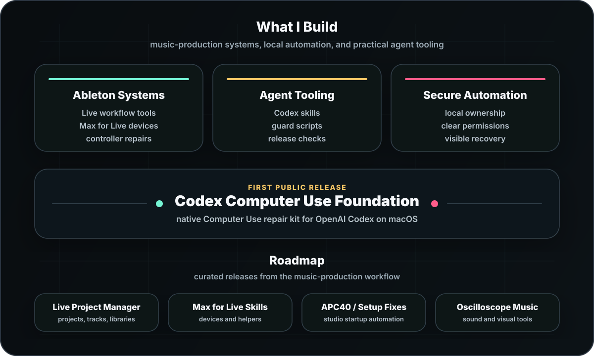

  

<h1 align="center">Steven Zeitter / DJ Jetski</h1>

  <strong>Music first. Practical tools when the workflow needs them.</strong> 
  Ableton Live, Max for Live, macOS automation, and OpenAI Codex systems.

  <a href="https://www.sowasvon.de"><strong>Website</strong></a>
  &nbsp;&nbsp;/&nbsp;&nbsp;
  <a href="https://www.instagram.com/djjetski_wav"><strong>Instagram</strong></a>
  &nbsp;&nbsp;/&nbsp;&nbsp;
  <a href="https://github.com/sponsors/DJJetski"><strong>Sponsor</strong></a>
  &nbsp;&nbsp;/&nbsp;&nbsp;
  <a href="https://github.com/DJJetski/codex-computer-use-foundation"><strong>First Release</strong></a>

  

## First Public Release

[Codex Computer Use Foundation](https://github.com/DJJetski/codex-computer-use-foundation) is a repair and validation kit for native OpenAI Codex Computer Use on macOS.

- Native launcher and guard repair path for local Codex Computer Use.
- Smoke checks, release audit scripts, and documented recovery boundaries.
- A practical first release before the larger music-tooling roadmap opens up.

## Roadmap

Public work here is intentionally curated. Projects go public when setup, documentation, security boundaries, and a usable release path are clear.

- **Live Project Manager**: macOS software for organizing Ableton projects, tracks, versions, and production libraries.
- **Max for Live / Ableton Skills**: device ideas, production helpers, validation workflows, and skill packs for music tooling.
- **Studio Automation**: APC40 MkII fixes, MIDI startup guards, audio-interface helpers, and local workflow glue.
- **Oscilloscope Music**: sound-design and visual-music tools for scope-based performance experiments.

## Working Style

Most tools here start as side-projects for my own music-production workflow. When something becomes useful, clean, and documented enough, I publish it for free.

Security matters because local automation touches real accounts, permissions, and files. Setup steps, recovery paths, and limitations should be visible instead of hidden behind a polished demo.

## Music

Music is the center. I release primarily as DJ Jetski, with Steven Maff as a second artist lane, and I have worked with Ableton since the early Live era.
