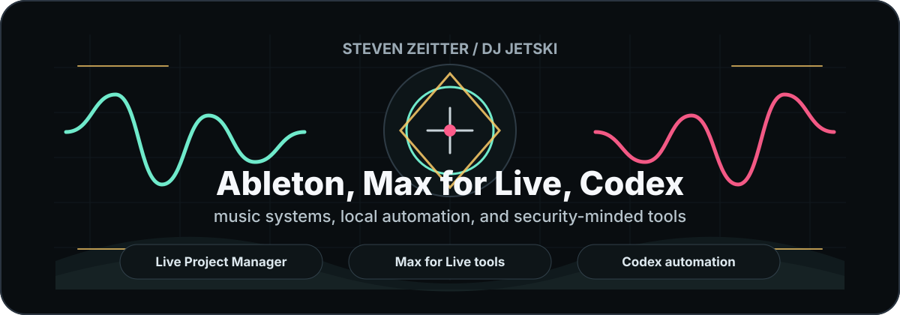

# Steven Zeitter / DJ Jetski

I build practical tools where music production, macOS automation, and developer workflows meet.

 

## What I Work On

- Native Computer Use reliability for OpenAI Codex on macOS: installers, repair scripts, verification tooling, and release hygiene.
- Ableton Live and Max for Live experiments for tighter creative workflows.
- Local automation that keeps clear owner boundaries, practical recovery paths, and reproducible setup steps.

## Current Focus

| Area | What I am building | Status |
| --- | --- | --- |
| Codex tooling | Computer Use repair and validation kit for macOS developer machines | Public release in progress |
| Music systems | Ableton Live / Max for Live workflow tools and sync experiments | Active exploration |
| Automation | Local scripts and operator workflows for reliable day-to-day Mac control | Iterating |

## Working Style

- I prefer small tools that solve real workflow friction.
- I document setup, verification, and recovery paths instead of leaving them implicit.
- I treat security and account boundaries as part of the product, especially for local automation.

## Public Work

The best public work is being prepared for release. This profile will stay focused on a small set of polished repositories instead of a long list of half-finished experiments.

## Music

I release and perform music as DJ Jetski.

[instagram.com/djjetski_wav](https://www.instagram.com/djjetski_wav)

## Sponsorship

Sponsorship is appreciated if my work saves you time or helps your setup. It is a voluntary donation, not a support contract, maintenance promise, or priority-response channel.
